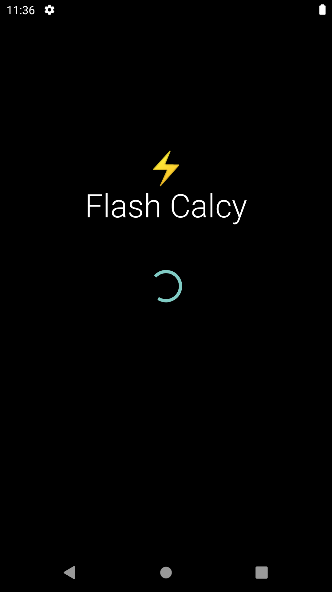
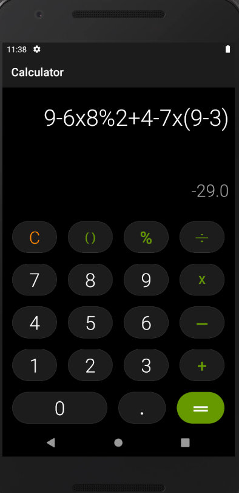
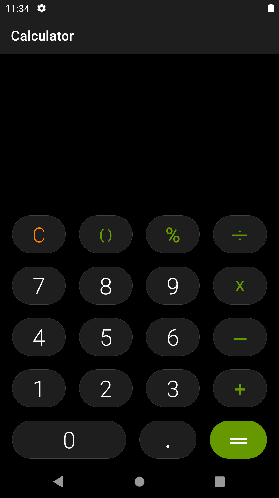
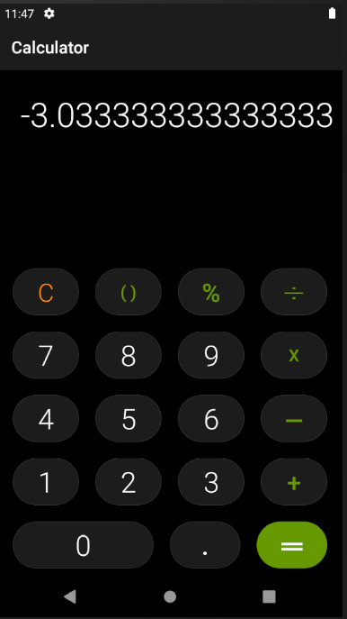
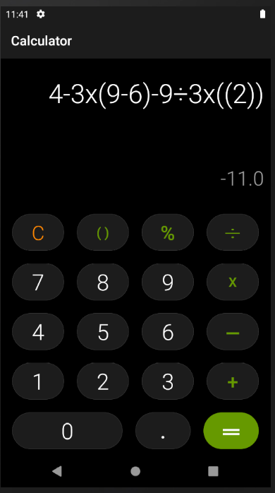
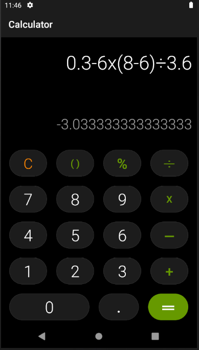

<!-- @format -->

# Flash-Calculator

An example of an Android Calculator App with all basic features and a minimal samsung-calculator-like interface
 

## ScreenShots

splash                   |       dynamic output display      | main - onClick `C` |
:-------------------------:|:-------------------------:|:-------------------------:
 |  | 
onClick `()`             |              onClick `.`      |         onClick `=`    |
 |  |   

## Note

This playful android app was one among a few created as per the requirements of `Mobile Communication and Computing` course lab experiments (Sem 7), Computer
Engineering - Mumbai University

© 2020 Darlene Nazareth